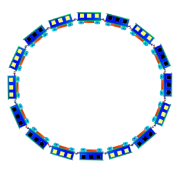

**"_Закольцованный поезд_"**

Вы находитесь в поезде, вагоны которого закольцованы:
последний вагон прицеплен к первому (кабина машиниста отсутствует).
Все вагоны абсолютно идентичны, освещение вагонов можно изменять.
Начальное распределение темных и светлых вагонов заранее неизвестно. 
Вы можете свободно перемещаться между вагонами и включать / выключать 
свет в вагоне, в котором находитесь.

**Вопрос:**

Придумать алгоритм, который позволит определить количество вагонов в поезде.

**Решение**

Будем считать, что изначально мы находимся в светлом вагоне. 
Если же это темный вагон, включим в нем свет. Теперь идем по составу вперед, 
считая вагоны. Направление движения совсем не важно, 
можно идти и в противоположную сторону.

Если в очередном вагоне темно, то идем в следующий. 
Если же в вагоне горит свет, то выключаем его и идем обратно в первый 
вагон. 

Если в первом вагоне темно, то мы определили длину поезда: 
она равна числу пройденных вагонов + первый вагон. 

Если же в первом вагоне включен свет, тогда идем по составу 
в противоположную сторону, пока не встретим очередной светлый вагон, 
и повторяем процедуру. 

Рано или поздно во всем поезде не останется светлых 
вагонов и мы определим длину кольца.

_P.s._ Направление движения с первого вагона можно и не менять после каждого 
прохода, но тогда прийдется потратить больше времени, что бы найти ответ.